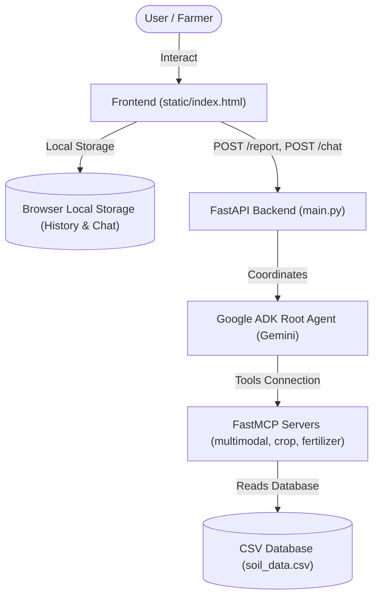
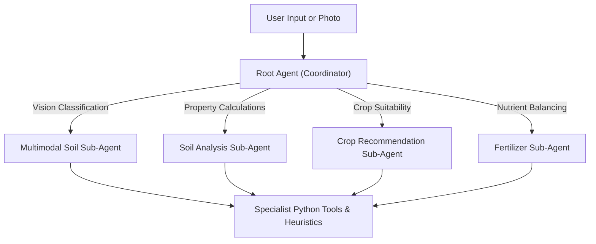
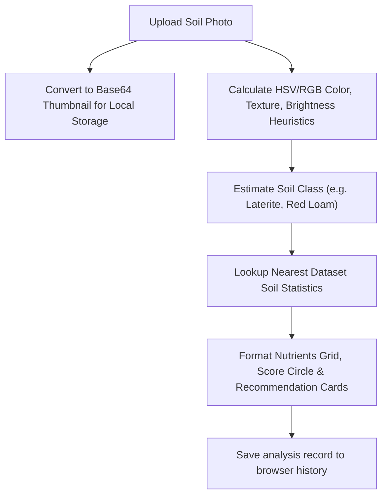
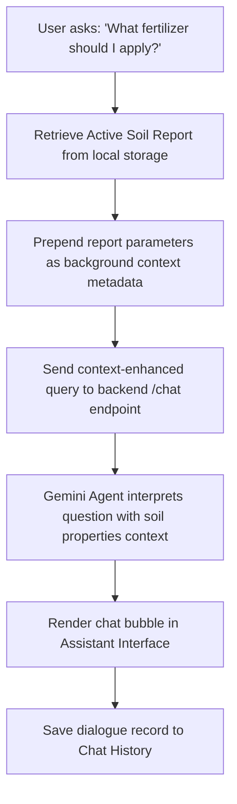

# Technical Architecture - SoilSense AI

This document details the system design, components, and workflows of the SoilSense AI application.

---

## Overall Architecture

The application follows a standard multi-tier architecture with browser-based client storage:

---

## Agent Workflow

The Root Coordinator Agent routes tasks dynamically to specialist sub-agents using a ReAct reasoning loop:

---

## Image Analysis Flow

The image diagnostic pipeline utilizes visual heuristics followed by database queries:

---

## Farmer Assistant Flow

The conversational chatbot provides context-aware assistance by combining local reports with questions:

